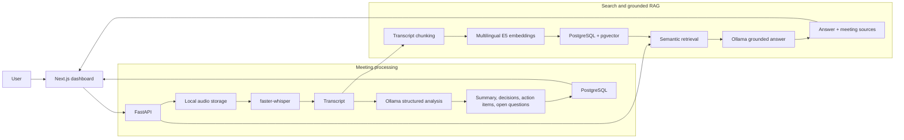

# AI Meeting Assistant

[](https://github.com/ProKesha/ai-meeting-assistant/actions/workflows/ci.yml)

AI Meeting Assistant turns meeting recordings into searchable, structured knowledge. It transcribes audio, extracts summaries and follow-ups, stores meeting history, and answers questions across past meetings with source-grounded local AI.

## Key Features

- MP3, WAV, and M4A meeting audio upload with size and type validation
- Local transcription with faster-whisper
- Optional OpenAI transcription provider
- Structured Ollama analysis validated with Pydantic
- Summaries, decisions, action items, assignees, deadlines, priorities, and open questions
- PostgreSQL meeting history and stored meeting detail
- Deterministic transcript chunking with overlap
- Local multilingual E5 embeddings stored as `vector(384)` values
- pgvector cosine-similarity search across meeting transcripts
- Grounded question answering over retrieved meeting context
- Source attribution linking answers back to stored meetings
- Responsive and accessible Next.js dashboard with recent meeting history

The default local setup uses `faster-whisper`, `intfloat/multilingual-e5-small`, and Ollama with `llama3.2:3b`. No paid AI API is required for that configuration.

## Quick Start (after initial setup)

From the repository root, start the complete local application with:

```bash
./start.sh
```

Then open [http://localhost:3000](http://localhost:3000). On macOS and supported Linux desktops, the script also attempts to open this URL automatically; browser-launch failure does not stop the application.

`start.sh` checks the project environment, PostgreSQL, Ollama, and the required model; applies Alembic migrations; then starts FastAPI and the Next.js development server. Press `Ctrl+C` to stop every process started by the script. An Ollama service that was already running is left untouched.

This is a startup command, not an installer. Initial machine setup still requires PostgreSQL with pgvector, Ollama and `llama3.2:3b`, the root `.env`, Python dependencies in `.venv`, and frontend dependencies in `frontend/node_modules`. Follow [Local Setup](#local-setup) once before using the command.

## Docker

Docker Compose provides a reproducible production-style local environment with separate PostgreSQL/pgvector, migration, FastAPI, and Next.js containers. Copy the development configuration and replace the placeholder database password before the first run:

```bash
cp .env.example .env
docker compose up --build
```

This default command expects Ollama to be running on the host. The backend reaches it through `host.docker.internal`; the Compose configuration includes the Linux `host-gateway` mapping as well as Docker Desktop support. A host Ollama service on Linux must listen on an address reachable from Docker, not only `127.0.0.1`.

For the most portable all-Docker local AI setup, use the optional `local-ai` profile. The first command starts PostgreSQL and Ollama, the second downloads the configured model once into the persistent Ollama volume, and the final command starts the complete stack:

```bash
docker compose --profile local-ai up -d postgres ollama
docker compose --profile local-ai exec ollama ollama pull llama3.2:3b
DOCKER_OLLAMA_BASE_URL=http://ollama:11434 \
  docker compose --profile local-ai up --build
```

Open [http://localhost:3000](http://localhost:3000). The API and interactive documentation are available at [http://localhost:8000](http://localhost:8000) and [http://localhost:8000/docs](http://localhost:8000/docs).

Alembic runs exactly once in the `migrate` service before the backend starts. PostgreSQL data, uploaded audio, Ollama models, and Hugging Face/faster-whisper model caches use named volumes; model weights are never copied into application images or committed to Git. The first transcription or embedding request can still take time while its selected local model is downloaded into the cache volume.

`NEXT_PUBLIC_API_BASE_URL` is a browser-visible Next.js build-time setting. If the backend is exposed on another host or port, set `DOCKER_PUBLIC_API_BASE_URL` before rebuilding the frontend image. Compose database credentials come from `.env`; production credentials do not belong in this development Compose file.

Stop the stack without deleting persistent data:

```bash
docker compose --profile local-ai down
```

The existing [`./start.sh`](./start.sh) workflow remains the recommended fast local-development loop on macOS and Linux; Docker is intended for reproducibility and production-image verification.

## Architecture



Processing persists the transcript, structured analysis, action items, ordered transcript chunks, and their embeddings before a meeting is marked `completed`. If transcription, analysis, embedding generation, or persistence fails, the meeting is not reported as successfully processed.

## How It Works

1. Upload a meeting recording.
2. The app transcribes and analyzes it.
3. Results are stored in meeting history.
4. Transcript chunks are embedded and indexed in pgvector.
5. Ask questions across previous meetings.
6. Answers are grounded in retrieved meeting sources.

## Tech Stack

### Frontend

- Next.js
- TypeScript
- Tailwind CSS

### Backend

- Python
- FastAPI and Uvicorn
- Pydantic and pydantic-settings
- SQLAlchemy 2.x async with asyncpg
- Alembic

### AI

- faster-whisper
- Ollama with `llama3.2:3b`
- `intfloat/multilingual-e5-small`
- pgvector
- Optional OpenAI Speech-to-Text

### Database

- PostgreSQL

### Testing

- pytest
- FastAPI dependency overrides
- Mocked AI providers and isolated test persistence

## Project Structure

```text
ai-meeting-assistant/
├── app/
│   ├── api/             # FastAPI routes and request-scoped dependencies
│   ├── core/            # Settings and shared constants
│   ├── db/              # Async SQLAlchemy setup and database models
│   ├── models/          # Pydantic API schemas
│   ├── repositories/    # Persistence and vector-search queries
│   └── services/        # Audio, AI, chunking, retrieval, and RAG logic
├── alembic/             # PostgreSQL and pgvector migrations
├── frontend/            # Next.js dashboard and typed API client
├── tests/               # Backend unit and integration tests
├── storage/             # Runtime audio files; excluded from Git
├── Dockerfile           # Production-oriented FastAPI image
├── docker-compose.yml   # PostgreSQL, migrations, backend, frontend, and optional Ollama
├── pyproject.toml       # Python package and test configuration
└── README.md
```

## API Overview

| Method | Endpoint | Purpose |
| --- | --- | --- |
| `GET` | `/health` | Check backend health |
| `POST` | `/api/v1/meetings` | Create a meeting record |
| `GET` | `/api/v1/meetings` | List recent meetings with pagination |
| `GET` | `/api/v1/meetings/{meeting_id}` | Retrieve stored meeting details |
| `POST` | `/api/v1/meetings/{meeting_id}/audio` | Validate and store meeting audio |
| `POST` | `/api/v1/meetings/{meeting_id}/transcribe` | Transcribe previously uploaded audio |
| `POST` | `/api/v1/meetings/{meeting_id}/analyze` | Analyze a supplied transcript |
| `POST` | `/api/v1/meetings/{meeting_id}/process` | Run transcription, analysis, chunking, embedding, and persistence |
| `POST` | `/api/v1/search` | Search transcript chunks by semantic similarity |
| `POST` | `/api/v1/ask` | Answer a question from retrieved meeting context and return sources |

Interactive OpenAPI documentation is available at [http://127.0.0.1:8000/docs](http://127.0.0.1:8000/docs) while the backend is running.

## Local Setup

### Requirements

- Python 3.12 or newer
- Node.js 20.9 or newer and npm
- PostgreSQL with the pgvector extension available
- Ollama

The first local embedding run downloads `intfloat/multilingual-e5-small` if it is not already present in the Sentence Transformers cache.

### Backend

Create and activate a virtual environment, then install the application and development dependencies:

```bash
python3.12 -m venv .venv
source .venv/bin/activate
python -m pip install --upgrade pip
python -m pip install -e ".[dev]"
```

Create a PostgreSQL database:

```bash
createdb ai_meeting_assistant
```

Copy the environment template and replace its development placeholders with settings for your machine:

```bash
cp .env.example .env
```

The PostgreSQL server must have pgvector available, and the migration user must be allowed to enable it. Alembic runs the following statement, so it does not normally need to be run separately:

```sql
CREATE EXTENSION IF NOT EXISTS vector;
```

Apply all migrations:

```bash
alembic upgrade head
```

Start Ollama in its own terminal:

```bash
ollama serve
```

With the Ollama service running, pull the default analysis/RAG model from another terminal:

```bash
ollama pull llama3.2:3b
```

Run the API from the repository root with the virtual environment active:

```bash
uvicorn app.main:app --reload
```

The backend runs at `http://127.0.0.1:8000` by default.

### Frontend

In a separate terminal:

```bash
cd frontend
cp .env.example .env.local
npm ci
npm run dev
```

Open [http://localhost:3000](http://localhost:3000).

## Environment Variables

Backend settings are read from the root `.env` file:

| Variable | Required | Purpose |
| --- | --- | --- |
| `DATABASE_URL` | Yes | Async SQLAlchemy PostgreSQL URL |
| `TRANSCRIPTION_PROVIDER` | Yes | `local` or `openai` |
| `LOCAL_WHISPER_MODEL` | Local transcription | faster-whisper model size or identifier |
| `LOCAL_WHISPER_DEVICE` | Local transcription | Inference device such as `cpu` |
| `LOCAL_WHISPER_COMPUTE_TYPE` | Local transcription | Compute type such as `int8` |
| `LOCAL_EMBEDDING_MODEL` | Yes | Sentence Transformers model used for passage and query embeddings |
| `LOCAL_EMBEDDING_DEVICE` | Yes | Embedding inference device such as `cpu` |
| `OPENAI_API_KEY` | OpenAI transcription only | Optional OpenAI credential; leave empty in local mode |
| `OPENAI_TRANSCRIPTION_MODEL` | OpenAI transcription only | OpenAI transcription model name |
| `OLLAMA_BASE_URL` | Yes | Ollama server URL |
| `OLLAMA_ANALYSIS_MODEL` | Yes | Ollama model used for structured analysis and grounded answers |

The frontend reads:

| Variable | Required | Purpose |
| --- | --- | --- |
| `NEXT_PUBLIC_API_BASE_URL` | Yes | Base URL of the FastAPI backend |

The committed `.env.example` files contain development placeholders only. Root `.env` files and frontend `.env.local` files are excluded from Git; do not commit credentials.

## Testing

Run backend verification from the repository root with the project virtual environment active:

```bash
pytest
alembic upgrade head
alembic check
python -m compileall -q app tests alembic
```

Run frontend verification separately:

```bash
cd frontend
npm run lint
npm run typecheck
npm run build
```

Current V1 release audit: **109 backend tests passed**, Alembic is at `0003_embedding_dimension`, and the frontend lint and production build checks pass. Automated tests mock heavyweight AI/model dependencies; they do not download Whisper or E5 models and do not require a live Ollama server.

## CI

GitHub Actions runs on every push and pull request targeting `main`. The pipeline has independent backend and frontend jobs, followed by a Docker gate only when both succeed:

- Backend dependency integrity and Python compilation
- PostgreSQL/pgvector startup, `alembic upgrade head`, and `alembic check`
- Backend pytest suite with mocked AI providers
- Frontend ESLint, TypeScript typecheck, and production build
- Docker Compose configuration validation
- Independent backend and frontend Docker image builds

The CI workflow does not call paid APIs, start Ollama, or download Whisper/E5/Ollama model weights.

## Local AI and Data

With `TRANSCRIPTION_PROVIDER=local`, meeting audio and text do not need to be sent to a paid AI API. Audio is stored under `storage/audio/` on the local filesystem. Meeting records, analyses, transcript chunks, and embeddings are stored in PostgreSQL.

Local operation is not itself a complete privacy or security guarantee. Deployment configuration, host access, database access, logs, and backups still need to match the sensitivity of the meeting data.

## Current Limitations

- Processing is synchronous and can keep an HTTP request open during AI inference.
- Audio uses local filesystem storage.
- Authentication, users, and access control are not implemented.
- There is no background job queue.
- Speaker diarization is not implemented.
- Local AI speed and output quality depend on the available hardware and selected models.
- Cloud deployment configuration is not included.

## Optional V2

- Authentication and per-user meeting access
- Background processing and progress updates
- Speaker diarization
- Cloud object storage and deployment
- Calendar and task-tracker integrations

V1 is functionally complete; these are optional follow-up directions rather than missing V1 requirements.

## What This Project Demonstrates

- End-to-end full-stack AI product delivery
- Local transcription, structured LLM output, embeddings, retrieval, and grounded RAG
- Async REST API design with PostgreSQL persistence and pgvector search
- Schema validation and explicit failure handling around AI providers
- Database evolution with reproducible Alembic migrations
- Testing AI workflows without live model or network dependencies
- A responsive frontend over typed backend contracts
